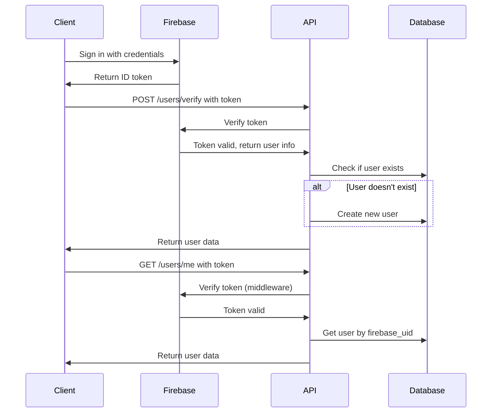

# Users Module - Firebase Authentication

## Overview

The users module provides Firebase-based authentication for the Didee API. It includes endpoints for token verification, user creation, and user information retrieval, along with a global authentication middleware.

## Features

✅ **Firebase Authentication Integration**
- Verify Firebase ID tokens
- Support for multiple auth providers (Email, Google, Facebook, Apple)
- Automatic user creation on first login

✅ **Authentication Middleware**
- Global protection for all routes by default
- Configurable public routes
- Automatic token verification

✅ **User Management**
- Get current user information
- CRUD operations for user data
- Provider-specific user handling

## Architecture

```
app/modules/users/
├── __init__.py          # Module initialization
├── router.py            # API endpoints
├── schemas.py           # Pydantic models
└── crud.py              # Database operations

app/core/
├── firebase.py          # Firebase authentication utility
├── dependencies.py      # Authentication dependencies
├── middleware.py        # Global auth middleware
└── config.py            # Configuration with Firebase settings
```

## API Endpoints

### 1. Verify Firebase Token
**POST** `/api/v1/users/verify`

Verifies a Firebase authentication token and creates a user if they don't exist in the database.

**Request:**
```json
{
  "firebase_token": "eyJhbGciOiJSUzI1NiIs..."
}
```

**Response (New User):**
```json
{
  "message": "User created successfully",
  "user": {
    "id": "550e8400-e29b-41d4-a716-446655440000",
    "firebase_uid": "firebase-uid-12345",
    "email": "user@example.com",
    "full_name": "John Doe",
    "avatar_url": "https://example.com/avatar.jpg",
    "phone_number": "+1234567890",
    "provider": "GOOGLE",
    "created_at": "2025-11-24T10:00:00",
    "updated_at": "2025-11-24T10:00:00"
  },
  "is_new_user": true
}
```

**Response (Existing User):**
```json
{
  "message": "User verified successfully",
  "user": { ... },
  "is_new_user": false
}
```

### 2. Get Current User
**GET** `/api/v1/users/me`

Returns information about the currently authenticated user.

**Headers:**
```
Authorization: Bearer <firebase-token>
```

**Response:**
```json
{
  "id": "550e8400-e29b-41d4-a716-446655440000",
  "firebase_uid": "firebase-uid-12345",
  "email": "user@example.com",
  "full_name": "John Doe",
  "avatar_url": "https://example.com/avatar.jpg",
  "phone_number": "+1234567890",
  "provider": "GOOGLE",
  "created_at": "2025-11-24T10:00:00",
  "updated_at": "2025-11-24T10:00:00"
}
```

## Authentication Flow



## Middleware

### Global Authentication Middleware

The `firebase_auth_middleware` automatically protects all routes except those listed in `PUBLIC_ROUTES`.

**Default Public Routes:**
- `/` - Root endpoint
- `/health` - Health check
- `/api/v1/docs` - API documentation
- `/api/v1/redoc` - ReDoc documentation
- `/api/v1/openapi.json` - OpenAPI schema
- `/api/v1/users/verify` - Token verification endpoint

**How it works:**
1. For each request, checks if the route is public
2. If not public, validates the Authorization header
3. Extracts and verifies the Firebase token
4. Stores decoded token in `request.state` for use in endpoints
5. Returns 401 if authentication fails

### Adding Public Routes

Edit `app/core/config.py`:

```python
PUBLIC_ROUTES: List[str] = [
    "/",
    "/health",
    "/api/v1/docs",
    "/api/v1/redoc",
    "/api/v1/openapi.json",
    "/api/v1/users/verify",
    "/api/v1/your-new-public-route",  # Add here
]
```

## Using Authentication in Your Endpoints

### Get Current User

```python
from fastapi import Depends, APIRouter
from app.core.dependencies import get_current_user
from app.models.user import User

router = APIRouter()

@router.get("/my-endpoint")
async def my_endpoint(current_user: User = Depends(get_current_user)):
    """This endpoint requires authentication"""
    return {
        "message": f"Hello {current_user.full_name}",
        "user_id": current_user.id
    }
```

### Optional Authentication

```python
from typing import Optional
from fastapi import Depends
from app.core.dependencies import get_optional_user
from app.models.user import User

@router.get("/public-but-personalized")
async def public_endpoint(user: Optional[User] = Depends(get_optional_user)):
    """Works with or without authentication"""
    if user:
        return {"message": f"Welcome back, {user.full_name}!"}
    return {"message": "Welcome, guest!"}
```

## Database Models

### User Model

Located in `app/models/user.py`:

```python
class User(BaseModel):
    id: str (UUID, primary key)
    firebase_uid: str (unique, indexed)
    email: str (unique, indexed)
    full_name: str (nullable)
    avatar_url: str (nullable)
    phone_number: str (unique, indexed, nullable)
    provider: UserProvider (enum)
    created_at: datetime
    updated_at: datetime
```

### Supported Providers

- `EMAIL` - Email/password authentication
- `GOOGLE` - Google Sign-In
- `FACEBOOK` - Facebook Login
- `APPLE` - Sign in with Apple

## Configuration

### Environment Variables

Add to your `.env` file:

```env
# Firebase Configuration
FIREBASE_CREDENTIALS_PATH=./firebase-credentials.json
```

### Firebase Credentials

1. Go to [Firebase Console](https://console.firebase.google.com/)
2. Select your project
3. Go to Project Settings → Service Accounts
4. Click "Generate New Private Key"
5. Save the JSON file as `firebase-credentials.json`
6. Set the path in `FIREBASE_CREDENTIALS_PATH`

**Security Note:** Never commit your Firebase credentials file! Add it to `.gitignore`.

## Error Handling

### Common Errors

| Status Code | Error | Cause |
|-------------|-------|-------|
| 401 | Missing authentication token | No Authorization header provided |
| 401 | Invalid authentication token | Token is malformed or invalid |
| 401 | Authentication token has expired | Token needs to be refreshed |
| 401 | Authentication token has been revoked | User's token was revoked in Firebase |
| 404 | User not found | User hasn't called /users/verify yet |
| 503 | Firebase authentication is not configured | FIREBASE_CREDENTIALS_PATH not set |

### Example Error Response

```json
{
  "detail": "Invalid authentication token",
  "error": "unauthorized"
}
```

## Client Integration Examples

### JavaScript/TypeScript (Web)

```typescript
import { getAuth, signInWithEmailAndPassword } from 'firebase/auth';

// Initialize Firebase (do this once in your app)
const auth = getAuth();

// Sign in user
const userCredential = await signInWithEmailAndPassword(
  auth, 
  'user@example.com', 
  'password'
);

// Get ID token
const idToken = await userCredential.user.getIdToken();

// Verify with backend
const response = await fetch('http://localhost:8000/api/v1/users/verify', {
  method: 'POST',
  headers: { 'Content-Type': 'application/json' },
  body: JSON.stringify({ firebase_token: idToken }),
});

const { user } = await response.json();
console.log('User created/verified:', user);

// Make authenticated requests
const meResponse = await fetch('http://localhost:8000/api/v1/users/me', {
  headers: { 'Authorization': `Bearer ${idToken}` },
});

const currentUser = await meResponse.json();
```

### React Native

```javascript
import auth from '@react-native-firebase/auth';

// Sign in
const userCredential = await auth().signInWithEmailAndPassword(
  'user@example.com',
  'password'
);

// Get token
const idToken = await userCredential.user.getIdToken();

// Use with API (same as web example)
```

### Python (Testing)

```python
import requests

# Get token from Firebase (in your client app)
firebase_token = "eyJhbGciOiJSUzI1NiIs..."

# Verify token
response = requests.post(
    'http://localhost:8000/api/v1/users/verify',
    json={'firebase_token': firebase_token}
)
print(response.json())

# Get current user
response = requests.get(
    'http://localhost:8000/api/v1/users/me',
    headers={'Authorization': f'Bearer {firebase_token}'}
)
print(response.json())
```

## Testing

### Run the test script

```bash
python test_firebase_auth.py
```

This will:
1. Test public routes (no authentication)
2. Test protected routes without token (should fail)
3. Prompt for a Firebase token to test authenticated endpoints

### Manual Testing with curl

```bash
# Test public endpoint
curl http://localhost:8000/health

# Test protected endpoint without token (should fail)
curl http://localhost:8000/api/v1/users/me

# Verify token
curl -X POST http://localhost:8000/api/v1/users/verify \
  -H "Content-Type: application/json" \
  -d '{"firebase_token": "YOUR_TOKEN_HERE"}'

# Get current user
curl http://localhost:8000/api/v1/users/me \
  -H "Authorization: Bearer YOUR_TOKEN_HERE"
```

## CRUD Operations

The `crud.py` module provides these operations:

```python
from app.modules.users import crud

# Get user by ID
user = crud.get_user_by_id(db, user_id)

# Get user by Firebase UID
user = crud.get_user_by_firebase_uid(db, firebase_uid)

# Get user by email
user = crud.get_user_by_email(db, email)

# Create user
user = crud.create_user(db, user_data)

# Update user
user = crud.update_user(db, user_id, user_data)

# Delete user
success = crud.delete_user(db, user_id)
```

## Security Best Practices

1. ✅ **Never commit credentials** - Firebase service account keys should never be in version control
2. ✅ **Use environment variables** - Store paths and secrets in `.env`
3. ✅ **Validate server-side** - Always verify tokens on the backend (this API does)
4. ✅ **Use HTTPS in production** - Prevents token interception
5. ✅ **Rotate keys regularly** - Generate new service account keys periodically
6. ✅ **Implement token refresh** - Client should refresh expired tokens
7. ✅ **Use Firebase security rules** - Limit what authenticated users can access in Firebase
8. ✅ **Monitor authentication** - Track failed auth attempts

## Troubleshooting

### "Firebase authentication is not configured"

**Cause:** `FIREBASE_CREDENTIALS_PATH` is not set or file doesn't exist

**Solution:**
1. Download Firebase service account key
2. Set `FIREBASE_CREDENTIALS_PATH` in `.env`
3. Restart the API server

### "User not found. Please verify your account first"

**Cause:** User hasn't called `/users/verify` endpoint

**Solution:** Client must call `/users/verify` before accessing `/users/me`

### "Invalid authentication token"

**Causes:**
- Token is expired (Firebase tokens expire after 1 hour)
- Token is malformed
- Using wrong token type (refresh token instead of ID token)

**Solution:** Get a fresh ID token from Firebase client SDK

### Import errors for firebase-admin

**Cause:** Package not detected by Python language server

**Solution:** Restart VS Code or run:
```bash
uv pip install firebase-admin
```

## Performance Considerations

- Firebase token verification requires network calls to Google's servers
- Consider implementing token caching for frequently accessed tokens
- Use connection pooling for database operations
- Monitor middleware performance with the `X-Process-Time` header

## Next Steps

- Implement user profile updates
- Add user deletion endpoint
- Add admin role and permissions
- Implement rate limiting for authentication endpoints
- Add refresh token handling
- Add user activity logging

## Support

For more information:
- [Firebase Authentication Documentation](https://firebase.google.com/docs/auth)
- [Firebase Admin SDK Python](https://firebase.google.com/docs/admin/setup)
- See `FIREBASE_SETUP.md` for detailed setup instructions
